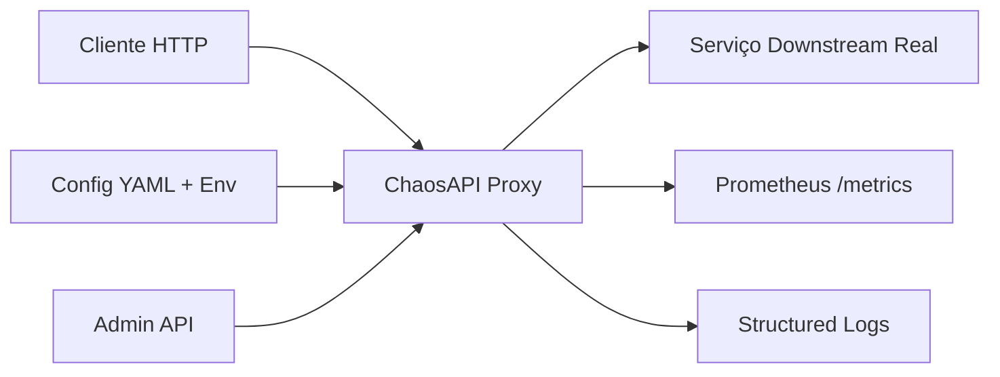

# Convenções de Arquitetura e Código - ChaosAPI

> Este documento é um contrato executável: agentes de IA e novos devs leem antes de agir.
> Atualize no mesmo PR que torna a mudança verdadeira. Nunca como follow-up.

| Campo | Valor |
|---|---|
| Projeto | ChaosAPI |
| Versão do documento | 1.0 |
| Última atualização | 2026-07-19 |
| Responsável | Henrique Costa |
| Status | `revisado` |

---

## 1. Tecnologias (stack)

### 1.1 Visão geral

| Camada | Tecnologia | Versão | Por que foi escolhida |
|---|---|---|---|
| Linguagem | Go | 1.22+ | Simplicidade, concorrência nativa, single binary, ecossistema HTTP maduro |
| Runtime / plataforma | Linux (container) | — | Deploy universal; single binary roda em qualquer distro |
| Framework HTTP | stdlib `net/http` + `https://github.com/go-chi/chi` | chi v5 | Router leve, middleware chain, compatível stdlib, zero reflection |
| WebSocket | `github.com/gorilla/websocket` | v1.5 | Upgrade HTTP → WebSocket padrão da indústria |
| Config | `gopkg.in/yaml.v3` | v3 | YAML legível, suporte a anchors/aliases para DRY |
| Métricas | `github.com/prometheus/client_golang` | v1.17 | Cliente Prometheus oficial; exposition format nativo |
| Logs | `github.com/rs/zerolog` | v1.32 | JSON structured logging, zero allocation, leveled, sampling |
| Testes | stdlib `testing` + `github.com/stretchr/testify` | v1.9 | Table-driven tests; testify para assertions legíveis |
| Build | Go toolchain + `goreleaser` | v2 | Cross-compile, releases automatizados, SBOM, signing |
| Container | Docker multi-stage (scratch/distroless) | — | Imagem < 20MB; non-root; sem shell |
| CI/CD | GitHub Actions | — | Nativo no repo; matrix build; release automation |

### 1.2 Política de versões e dependências

- Gerenciador de pacotes obrigatório: `go mod` — `go.sum` versionado e nunca regenerado sem justificativa.
- Estratégia de atualização: patch/minor automáticos via Dependabot; major exige ADR.
- Critérios para adicionar uma nova dependência:
  1. Resolve um problema real que já apareceu, não um hipotético
  2. Manutenção ativa nos últimos 6 meses
  3. Custo de binary aceitável: < 500 kB adicionado ao binary final
  4. Existe caminho de saída (é substituível sem reescrever o domínio)
- Dependências proibidas / desencorajadas:
  - Frameworks web pesados (Gin, Echo, Fiber) — stdlib + chi é suficiente
  - ORMs — não há persistência relacional complexa
  - Libraries de config complexas (viper, cobra) — stdlib flags + YAML simples

### 1.3 Ambiente de desenvolvimento

| Item | Definição |
|---|---|
| OS suportado | Linux (prod), macOS/Windows (dev) |
| Versão de runtime | Fixada em `.tool-versions` (asdf) ou `go.work` |
| Variáveis de ambiente | Documentadas em `.env.example`, nunca commitadas |
| Comandos essenciais | `make dev` → `make test` → `make build` → `make lint` |

---

## 2. Filosofia de código

### 2.1 Princípios inegociáveis

1. **Clareza acima de esperteza** — código é lido muito mais vezes do que escrito.
2. **Explícito acima de implícito** — mágica (reflection, global state, init()) só com justificativa escrita.
3. **Simples agora, extensível depois** — evitar abstração antes do terceiro caso real.
4. **Erros são parte da API** — estados de erro modelados, não improvisados; `error` wrapping com `%w`.
5. **Sem estado global sem justificativa** — config singleton aceito; caches globais só com docs.

### 2.2 Regras práticas

| Tema | Regra | Exceção aceita |
|---|---|---|
| Tamanho de arquivo | ≤ 400 linhas; acima disso, dividir | — |
| Tamanho de função | ≤ 50 linhas / 1 responsabilidade | — |
| Aninhamento | máx. 3 níveis; usar early return | — |
| Comentários | explicam o *porquê*, nunca o *o quê* | — |
| Tipagem | `any` proibido exceto em `json.Marshal`/`Unmarshal`; `interface{}` só em boundary | — |
| Mutabilidade | structs imutáveis por padrão; `func (c *Config) WithX() *Config` para builders | — |
| Tratamento de erro | sem `catch` silencioso; sempre wrap ou log + return | — |
| Código morto | removido, não comentado — o histórico está no Git | — |

### 2.3 Convenções de nomenclatura

| Elemento | Padrão | Exemplo |
|---|---|---|
| Arquivos Go | `snake_case.go` | `policy_engine.go` |
| Tipos / interfaces | `PascalCase` | `Policy`, `Selector` |
| Constantes | `SCREAMING_SNAKE_CASE` | `DefaultTimeout` |
| Variáveis / funções | `camelCase` | `matchRequest`, `applyLatency` |
| Pacotes | `lowercase`, singular, curto | `policy`, `proxy`, `config` |
| Booleanos | prefixo `Is`/`Has`/`Should`/`Enable` | `IsEnabled`, `HasMatch` |
| Handlers HTTP | `Handle{Verb}{Resource}` | `HandleGetPolicy` |
| Interfaces | sufixo `er` ou substantivo | `Matcher`, `PolicyStore` |
| Arquivos de teste | `*_test.go` | `policy_engine_test.go` |
| Idioma do código | Inglês para código e commits; português para docs internas | — |

### 2.4 Estrutura de diretórios

```
/
    /docs
        -- CONVENTIONS.md
        -- DESIGN.md
        -- PRD.md
        -- TODO.md
        -- CHANGELOG.md
    /scripts
        /bootstrap
            -- bootstrap.ps1 (Instalação + inicialização - build + dev)
            -- bootstrap.sh
        /publish
            -- publish.ps1 (Build + login npm/registry + publish)
            -- publish.sh
    /application
        /cmd
            /chaosapi           # main.go - entry point
        /internal               # Código privado (não importável externamente)
            /config             # Carregamento/validação de config
            /policy             # Engine de políticas + seletores
            /proxy              # Reverse proxy + middleware de caos
            /metrics            # Prometheus metrics
            /logging            # Structured logging setup
            /health             # Health/readiness endpoints
        /pkg                    # Código público (importável por outros)
            /models             # Tipos compartilhados (Policy, Selector, etc.)
        /test                   # Test utilities, fixtures, integration tests
    /configs                    # Config examples (yaml, env)
    /deployments                # Dockerfile, docker-compose, k8s manifests
    README.md
    Makefile
    go.mod
    go.sum
```

Regras de import:
- Imports cruzados profundos (`../../..`) são proibidos; usar packages internos via `github.com/henri/chaosapi/internal/...`
- Cada package expõe somente o que está em seus tipos públicos; `internal/` nunca importado fora do módulo.

### 2.5 Testes

| Tipo | Escopo | Ferramenta | Meta |
|---|---|---|---|
| Unitário | Lógica pura: seletores, engine de políticas, config parsing | `testing` + `testify` | 80%+ coverage em `internal/policy`, `internal/config` |
| Integração | Proxy HTTP end-to-end: request → policy → downstream mock | `testing` + `httptest` | Fluxos críticos: latency, error, timeout, disconnect |
| Contrato | OpenAPI spec vs implementação | `github.com/getkin/kin-openapi` | Spec válida; handlers conformam |

- O que **sempre** exige teste: regra de negócio (policy match, selector logic), bug corrigido (regressão), utilitário compartilhado.
- O que **não** exige: main.go boilerplate, structs de dados simples (DTOs).
- Testes descrevem comportamento, não implementação: `TestSelector_MatchesPathRegex`, `TestPolicyEngine_AppliesLatency`.

### 2.6 Git e revisão

- Branches: `main` protegida; `feat|fix|chore|docs/{descricao-curta}`.
- Commits: Conventional Commits — `feat(policy): add latency jitter support`.
- PR: ≤ 400 linhas alteradas, descrição com contexto + como testar, 1 aprovação mínima.
- Merge: squash.
- Checklist de review:
  - [ ] Segue esta convenção
  - [ ] Testes cobrem o comportamento novo
  - [ ] Documentação atualizada no mesmo PR
  - [ ] Sem segredos, sem `log.Print`/`fmt.Print`, sem TODO órfão

---

## 3. Princípios de System Design

### 3.1 Atributos de qualidade priorizados

> Ordene. Arquitetura é a escolha do que sacrificar.

| # | Atributo | Meta mensurável | Trade-off aceito |
|---|---|---|---|
| 1 | Performance (overhead) | p99 < 5ms sem política ativa | Menos abstração genérica; hot path otimizado manualmente |
| 2 | Confiabilidade | 99.9% uptime; graceful shutdown 30s | Mais código de drain/cleanup |
| 3 | Operabilidade | Config hot-reload < 1s; single binary | Arquivo config simples; sem DB |
| 4 | Segurança | Zero vazamento secrets; mTLS opcional | Menos features de conveniência (ex: log body completo) |
| 5 | Extensibilidade | Nova política em ≤ 1 arquivo + 1 registro | Plugin system só se > 10 políticas |

### 3.2 Princípios estruturais

1. **Fronteiras antes de camadas** — o sistema é dividido por domínio (policy, proxy, config); camadas existem dentro de cada domínio.
2. **Dependências apontam para dentro** — `cmd/chaosapi` depende de `internal/*`; `internal/*` não conhece `cmd`.
3. **Fonte única da verdade** — config carrega uma vez; policies são a fonte de verdade para o proxy.
4. **Estado do servidor ≠ estado do cliente** — proxy é stateless; policies são config, não estado de conexão.
5. **Contratos explícitos nas bordas** — toda entrada externa (config YAML, HTTP request, env var) validada no ponto de entrada.
6. **Falha isolada** — erro em uma policy degrada (log + skip), não derruba o proxy; panic recovery em middleware.
7. **Idempotência e retry** — policies de erro/timeout são idempotentes; disconnect não é (by design).
8. **Observabilidade desde o dia 1** — structured log + request_id + metrics em toda request.
9. **Reversibilidade** — decisões baratas de desfazer (formato config, router); decisões caras (linguagem, arch) exigem ADR.
10. **Custo total, não custo local** — otimize para ciclo entender → mudar → entregar com segurança.

### 3.3 Contexto do sistema



| Integração | Tipo | Protocolo | Falha esperada | Estratégia |
|---|---|---|---|---|
| Downstream | Síncrona | HTTP/1.1 + WebSocket | Timeout, 5xx, connection refused | Retry policy (configurável) + circuit breaker opcional |
| Prometheus | Assíncrona (pull) | HTTP | Scrape timeout | Metrics endpoint leve; timeout 2s |
| Admin API | Síncrona | HTTP/JSON | Invalid config | Validação síncrona; rollback automático se hot-reload falha |

### 3.4 Concerns transversais

| Concern | Definição para este projeto |
|---|---|
| Autenticação / autorização | Admin API: opcional via header `X-API-Key` ou mTLS; downstream: passa headers transparente |
| Gestão de erros | Taxonomia: `ValidationError` (config), `PolicyError` (runtime policy), `ProxyError` (downstream), `InternalError` (bug). Quem trata: middleware de erro centralizado. |
| Logging e telemetria | Structured JSON (zerolog); fields obrigatórios: `request_id`, `method`, `path`, `policy_matched`, `latency_ms`, `upstream_status`, `error`. Sample rate 10% para success; 100% para error. |
| Configuração | Origem única: arquivo YAML + env var overrides; validada no boot; falha rápido se inválida. Hot-reload via SIGHUP ou POST `/admin/reload`. |
| Cache e invalidação | Policies em memória; invalidação por hot-reload; sem cache distribuído (single instance v1). |
| Segurança | Sem segredos no log; sanitização de headers sensíveis (Authorization, Cookie, X-API-Key); body logging opt-in com size limit. |
| Performance | Hot path (proxy) sem alocação desnecessária; sync.Pool para buffers; connection pooling para downstream. |

### 3.5 Restrições (constraints)

| Restrição | Origem | Negociável? |
|---|---|---|
| Deve rodar como single binary em container scratch/distroless | Operacional | Não |
| Overhead p99 < 5ms | Produto | Não (meta v1.0) |
| Config apenas YAML + env var (sem DB) | Simplicidade | Sim, com ADR |
| HTTP/1.1 + WebSocket apenas (sem HTTP/2, gRPC) | Escopo v1 | Sim, v1.1+ |

### 3.6 Registro de decisões (ADR)

> Uma decisão arquitetural relevante = um arquivo em `docs/adr/NNN-titulo.md`.
> Relevante = cara de reverter, afeta várias equipes ou define uma fronteira.

| ID | Decisão | Status | Data |
|---|---|---|---|
| ADR-001 | Go + stdlib/chi over framework web | `aceita` | 2026-07-19 |
| ADR-002 | YAML config + env var over DB | `aceita` | 2026-07-19 |
| ADR-003 | Single-tenant, single-instance v1 | `aceita` | 2026-07-19 |
| ADR-004 | Structured JSON logging (zerolog) | `aceita` | 2026-07-19 |
| ADR-005 | Deferir chaos por frame em WebSocket para v1.1 | `aceita` | 2026-07-20 |

**Modelo de ADR (formato Nygard):**

```markdown
# ADR-{NNN}: {título curto em forma de substantivo}

- **Status:** {proposta | aceita | substituída por ADR-XXX | descontinuada}
- **Data:** {AAAA-MM-DD}

## Contexto
{Forças em jogo - técnicas, de prazo, de time. Linguagem neutra, apenas fatos.}

## Decisão
{"Nós vamos ..." - voz ativa, frase completa.}

## Alternativas consideradas
| Opção | Prós | Contras | Por que não |

## Consequências
{Todas - positivas, negativas e neutras. Inclua ADRs que esta decisão gera.}
```

### 3.7 Anti-padrões proibidos neste projeto

- Lógica de negócio (policy match) dentro de handler HTTP
- Abstração criada para um único caso de uso
- `sync.Mutex` no hot path do proxy (use channels ou atomic)
- Try/catch (recover) que engole o erro sem log estruturado
- Configuração lida diretamente de `os.Getenv` fora do package `config`
- `interface{}` / `any` em assinaturas de funções públicas (exceto boundary JSON)

### 3.8 Dívida técnica conhecida

| Item | Impacto | Custo estimado | Gatilho para pagar |
|---|---|---|---|
| HTTP/2 support | Médio | 1 semana | Cliente exige h2 downstream |
| Chaos por frame (latency/corrupt) em WebSocket ([ADR-005](adr/005-defer-websocket-frame-chaos.md)) | Médio | 3-5 dias | Demanda de paridade HTTP/WS + testes de integração WS existentes |
| Persistência policies em DB | Baixo | 3 dias | Multi-instance / auditoria |
| UI/Admin dashboard | Alto | 2+ semanas | Demanda real de usuários não-técnicos |

---

## 4. Glossário

| Termo | Definição |
|---|---|
| Policy | Regra de caos (latency, error, timeout, disconnect, truncate, corrupt) + seletor |
| Selector | Critério de match (path, header, query, method, probability) |
| Upstream | Cliente que chama a ChaosAPI |
| Downstream | Serviço real atrás da ChaosAPI |
| Hot-reload | Recarregar config sem restart do processo (SIGHUP ou API) |
| Overhead | Latência adicionada pelo proxy além da policy configurada |

---

## 5. Referências

- [Effective Go](https://go.dev/doc/effective_go)
- [Go Code Review Comments](https://github.com/golang/go/wiki/CodeReviewComments)
- [Architecture Decision Records (Nygard)](https://cognitect.com/blog/2011/11/15/documenting-architecture-decisions)
- [Prometheus Go client best practices](https://prometheus.io/docs/guides/go-application/)
- [zerolog documentation](https://github.com/rs/zerolog)
- Documentos internos: [PRD.md](PRD.md), [README.md](../README.md), [DESIGN.md](DESIGN.md)

## 6. Changelog do documento

| Data | Versão | Mudança | Autor |
|---|---|---|---|
| 2026-07-19 | 0.1.0 | Versão inicial | Henri |